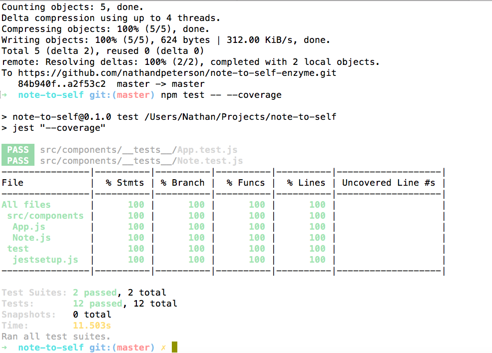

Just a basic to-do app to practice testing with jest and enzyme.

Coding along with a udemy tutorial [here](https://github.com/15Dkatz/react-testing/).

* Jest
* Enzyme
* React

Full coverage (for this admittedly simple app):


To start tests, use ```jest --watch```